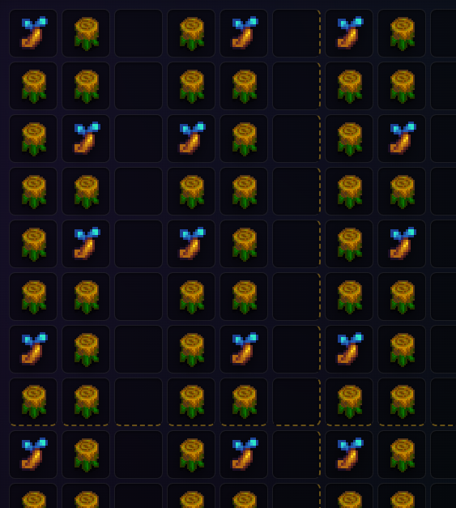
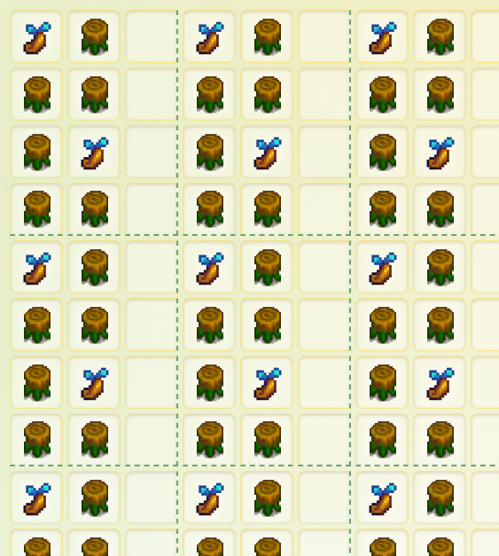
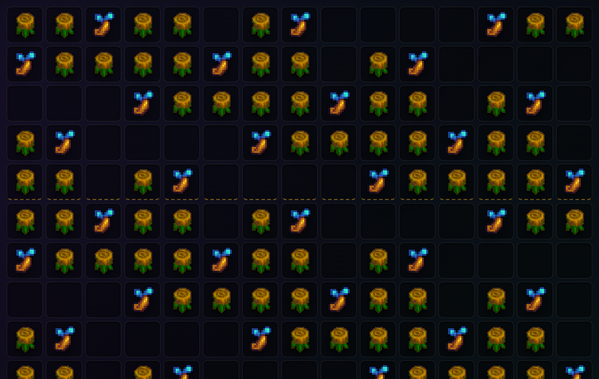

# Mushroom Masher (Stardew Valley Mushroom Farm Designer)

Mushroom masher is a tool to design and optimize [mushroom
log](https://stardewvalleywiki.com/Mushroom_Log) farms. Because mushroom logs
rely on complex proximity rules to calculate yield, quality, and mushroom type,
finding the optimal setup is non-obvious.

## How to Use the App

The tool provides an interactive grid where you can design your farm, estimate
yields, and compare efficiency.

### 1. Designing Your Layout

- **Grid Configuration:** Start by setting your farm width and height. Use the
  **Tileable Mode** if you are designing a repeating "chunk" of a farm layout
  (e.g., a repeating 7x7 block). Enable "wrap-around" to treat the layout as an
  infinite tiling for the purposes of calculation. This can be used to evaluate
  the relative efficiency of different tileable farm patterns.
- **Tools:**
  - **Mushroom Logs:** Place logs on the grid. Hovering over a placed log
    highlights its 7x7 detection radius.
  - **Trees:** Place specific tree types (oak, maple, pine, mystic, etc.). The
    type of tree influences the types of mushrooms produced.
  - **Moss Tool:** Toggle moss on trees. For calculating mushroom quality, mossy
    trees count double. Only oak, pine, and maple trees can be mossy.
  - **Tappers / Heavy Tappers:** More products from the same space!

### 2. Configuring Farm Parameters

- **Location and Rain:** Choose your farm location (Main Farm, Ginger Island, or
  Calico Desert). This affects average rain rates. You can use rain totems to
  increase the frequency of harvests.
- **Professions:** Artisan and Tapper professions increase the value of
  processed mushrooms and tapper products respectively.
- **Processing Strategy:** Select your desired processing method for each
  mushroom type (dehydrator, preserves jar, or sell unprocessed). The app
  automatically bypasses processing if selling the unprocessed, high-quality
  mushroom is more profitable. Pickled mushrooms are most profitable, but using
  the dehydrator on lower value mushrooms can dramatically decrease the number
  of preserves jars required.

### 3. Analyzing Results

The calculated output of your farm appears in a panel on the right and is
updated as you edit the farm:
- **Combined Gold / Year:** Total profit including both logs and tappers.
- **Per-Log Breakdown:** Expanding the per-log details shows you exactly what
  each log sees in its 7x7 grid and its specific expected yield, quality
  breakdown, and mushroom type probabilities.
- **Required Machinery:** Tells you the minimum number of dehydrators and
  preserves jars you need to keep up with your specific layout's production
  rate.

## The Math

Calculations are based on documentation in the [Stardew Valley
Wiki](https://stardewvalleywiki.com/) for version 1.6. Here is a rough breakdown
of the mechanics:

### Harvest frequency (the rain mechanic)

Mushroom Logs have a base cycle of **4 days**. However,
[rain](https://stardewvalleywiki.com/Weather) reduces the remaining time by 1
day.
- The app calculates the average cycle days based on the statistical probability
  of rain for your selected location. The desert does not rain at all, and
  Ginger Island has a flat 24% chance. Rain in Pelican Town has an overall
  average rate of ~13.56%, based on the following factors:
  - Spring and Fall have a flat 18.3% chance of rain.
  - Summer rain odds increase daily, plus 1 guaranteed Green Rain day.
  - There is no rain in winter without rain totems.
  - There is no rain on the first day of any season.
  - Festival days are always sunny (including the desert festival).
- Rain totems can be used to force rain every day, excluding festivals and the
  first of the season. This is equivalent to a rain probability of 89%. Rain
  totems affect only the location they are used, and they have no effect in the
  desert.

### Mushroom quantity

When a [log](https://stardewvalleywiki.com/Mushroom_Log) generates mushrooms, it
scans a 7x7 square centered on itself for [wild
trees](https://stardewvalleywiki.com/Trees). The count is divided by two,
rounding down. 50% of the time, it's then multiplied by 2. The final output
quantity is clamped between 1 and 5.
- To guarantee the maximum yield of **5 mushrooms per harvest**, a log must have
  at least **10 trees** in its 7x7 radius.
- However, the number reducing the number of logs to fit 10 trees might not
  always increase total farm production.
- Any trees beyond the 10th are always dead weight and taking up space that
  could be used for more logs or for walking space.
- Because of rounding, it's also **preferable to have an even number of trees in
  proximity of the log**. Both 8 or 9 produce an average of 4.5 mushrooms per
  harvest. That 9th tree is also dead weight.

### Mushroom types

The game uses a weighted pool system to determine which mushrooms are produced.
- **Step 1 (Basic Pool):** The game adds `max(1, floor(NearbyTrees * 0.75))`
  entries from a base distribution (80.75% Common, 14.25% Red, 5% Purple).
- **Step 2 (Tree Bonus):** The game adds **1 specific entry per mature tree**
  based on its type:
  - **Oak:** 100% Morel
  - **Pine:** 100% Chanterelle
  - **Mystic:** 100% Purple
  - **Maple:** 90% Red, 10% Purple
  - **Immature trees, or any other tree types:** Adds another entry from the
    base distribution.
- **Step 3:** The game picks one type randomly from this combined pool.

Each tree contributes both to its own mushroom types, as well as the size of the
basic pool. As such, the odds of a particular type don't necessarily increase
with more and more trees. For instance, a mushroom log surrounded by 3 mystic
trees has the same probability of producing purple mushrooms as one surrounded
by 9 mystic trees. More trees just means more mushrooms regardless of type. The
former will only produce 1-2 mushrooms per harvest, the latter produces 4-5. In
both cases, ~62% of the harvests will be purple.

### Mushroom quality

Mushroom quality is determined by the number of nearby trees, and
[mossy](https://stardewvalleywiki.com/Moss) trees count twice. The total count
is divided by 40 and used as a probability to upgrade quality through repeated
random rolls. For example, consider a log surrounded by 10 trees, 6 of which are
mossy. The odds for quality upgrades are `(10 + 6) / 40 = 40%`. 60% of the time
the output will be standard quality, 24% will be silver, 9.6% will be gold, and
6.4% will be iridium.

### Mushroom logs are farm machines

Under-the-hood, mushroom logs are implemented as farm machines, like furnaces,
kegs, etc. Counterintuitively, their output is determined at the time of the
previous harvest (or when they are first placed). As such, the mushroom type
produced may not match the trees surrounding it at the time of harvest. This is
likely to be noticed during a farm's first harvest. The trees may have been
immature when the logs were first placed, and immature trees contribute mushroom
types from the "basic" pool. The correct types will be produced with the
*second* harvest after all trees are mature.

Any individual harvest is the same type and quality. This tool calculates the
average output over all possibilities.

### Maximizing moss production (Tree Fertilizer)

tl;dr Using tree fertilizer will improve the quality of mushrooms on your farm
via faster moss growth, in addition to getting your farm started faster.

Tree saplings go through a number of stages, reaching maturity at stage 5.
However, the stage continues to advance after maturity (to a maximum of 15) for
the purpose of growing moss. Moss can only grow on trees that have reached at
least stage 14. Moss growth rates depend on the season and weather, and moss
disappears during winter. Harvesting moss sets the tree's growth stage back to
12-(number of moss harvested).

If you apply [tree fertilizer](https://stardewvalleywiki.com/Tree_Fertilizer) to
a oak, pine, maple, or green rain tree seed or sapling, it guarantees a 100%
chance to advance a growth stage every night. Crucially, **this fertilized
status remains permanently on the tree even after it reaches full maturity**.
Because the tree remains "fertilized," it continues to apply that 100% daily
growth check to the hidden stages. As a result, a tree fertilized as a sapling
will regenerate moss much faster than a naturally grown tree.

Tree Fertilizer cannot later be applied to mature trees, so must be applied to a
seed or sapling.

Mossy [green rain trees](https://stardewvalleywiki.com/Green_Rain_Trees) (type 1
and 2) accelerate moss growth on nearby trees. However, these tree types will
produce lower value types of mushrooms if near a mushroom log, so are not a good
idea for accelerating moss growth in a mushroom farm.

Moss itself has no impact on the *type* or *quantity* of mushrooms produced.
If you're processing your mushrooms (not affected by quality), your mushroom
farm can double as a moss farm.

Mystic trees can't grow moss, but they're slow growing, so tree fertilizer is
still a good idea.

### Tappers

If you equip [tappers](https://stardewvalleywiki.com/Tapper) or heavy tappers,
the app calculates expected yearly totals. By default, it uses independent
timers for each tree type. If you enable **Sync Tappers**, it limits tapper
harvests to align with your mushroom log harvest days to minimize the time spent
walking the farm.

## Sample Layouts

### KitaDollx

This layout is from **[a video by KitaDollx](https://youtu.be/Q3VRj6WaX8U)**.

It uses space very efficiently, with just 1/3 spaces empty, which I believe is
the minimum possible space for walking with a tileable farm pattern. Fully 50%
of the availble space is devoted to mushroom logs. 66.7% of the logs are within
range of exactly 10 trees, and 33.3% are within range of exactly 8. The average
log produces 4.83 mushrooms, so the net efficiency is **2.42 mushrooms per tile
per harvest**. The average number of trees per log and overall performance are
actually slightly *understated* in the video.

It's also a simple layout to build and fast to harvest with purely straight
paths.

### Simple Zig-Zag

This is similar to the KitaDollx layout, but a bit simpler. It's basically
equivalent, with the same knights-move spacing between trees, and **the
performance is identical**.

### Available-Log9102

This layout [was posted on
reddit](https://www.reddit.com/r/StardewValley/comments/1oeunhz/behold_an_underrated_way_to_get_millions_the_best/)
by user Available-Log9102.

Impressively, every square in the layout has exactly 10 trees within range, so
all logs produce 5 mushrooms every harvest. It also maintains only 33.3% empty
space, which is difficult without straight pathing. However, the additional
trees end up crowding out some logs, which are now only 46.7% of the available
area. The net result is an efficiency of **2.33 mushrooms per tile per
harvest**. In spite of its hypnotic symmetries, it slightly underperforms
simpler layouts (the original reddit post has incorrect numbers for the
KitaDollx layout).
